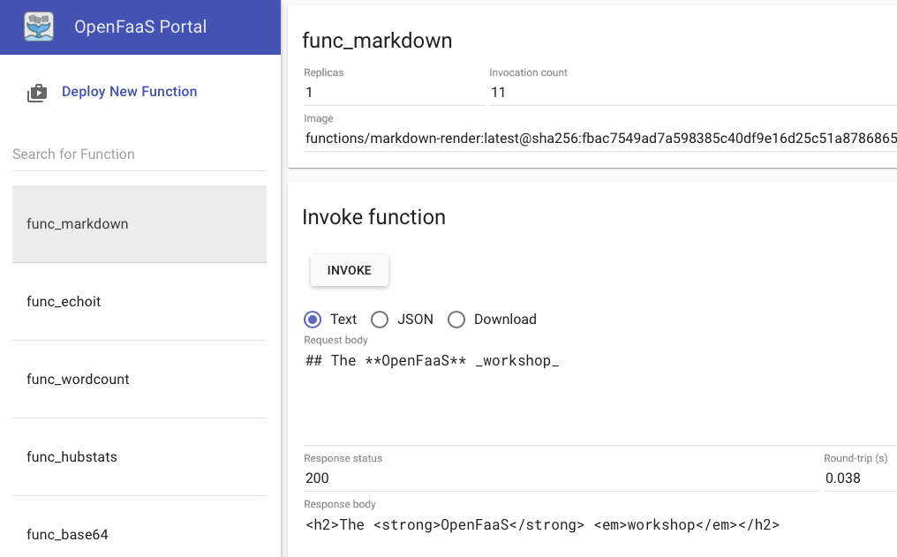

# Lab 2 - Test things out

</img>

Before starting this lab, create a new folder for your files:

```sh
$ mkdir -p lab2 \
   && cd lab2
```

## Use the UI Portal

You can now test out the OpenFaaS UI:

If you have set an `$OPENFAAS_URL` then get the URL and then click on it:

```sh
echo $OPENFAAS_URL
http://127.0.0.1:31112
```

If you haven't set an `$OPENFAAS_URL` then the default is normally: [http://127.0.0.1:8080](http://127.0.0.1:8080).

We can deploy some sample functions and then use them to test things out:

```sh
$ faas-cli deploy -f https://raw.githubusercontent.com/openfaas/faas/master/stack.yml
```



You can try them out in the UI such as the Markdown function which converts Markdown code into HTML.

Type the below into the *Request* field:

```sh
## The **OpenFaaS** _workshop_
```

Now click *Invoke* and see the response appear in the bottom half of the screen.

I.e.

```sh
<h2>The <strong>OpenFaaS</strong> <em>workshop</em></h2>
```

You will see the following fields displayed:

* Status - whether the function is ready to run. You will not be able to invoke the function from the UI until the status shows Ready.
* Replicas - the amount of replicas of your function running in the cluster
* Image - the Docker image name and version as published to the Docker Hub or Docker repository
* Invocation count - this shows how many times the function has been invoked and is updated every 5 seconds

Click *Invoke* a number of times and see the *Invocation count* increase.

## Deploy via the Function Store

You can deploy a function from the OpenFaaS store. The store is a free collection of functions curated by the community.

* Click *Deploy New Function*
* Click *From Store*
* Click *Figlet* or enter *figlet* into the search bar and then click *Deploy*

The Figlet function will now appear in your left-hand list of functions. Give this a few moments to be downloaded from the Docker Hub and then type in some text and click Invoke like we did for the Markdown function.

You'll see an ASCII logo generated like this:

```sh
 _  ___   ___ _  __
/ |/ _ \ / _ (_)/ /
| | | | | | | |/ / 
| | |_| | |_| / /_ 
|_|\___/ \___/_/(_)
```

## Learn about the CLI

You can now test out the CLI, but first a note on alternate gateways URLs:

If your *gateway is not* deployed at http://127.0.0.1:8080 then you will need to specify the alternative location. There are several ways to accomplish this:

1. Set the environment variable `OPENFAAS_URL` and the `faas-cli` will point to that endpoint in your current shell session. For example: `export OPENFAAS_URL=http://openfaas.endpoint.com:8080`. This is already set in [Lab 1](./lab1.md) if you are following the Kubernetes instructions.
2. Specify the correct endpoint inline with the `-g` or `--gateway` flag: `faas deploy --gateway http://openfaas.endpoint.com:8080`
3. In your deployment YAML file, change the value specified by the `gateway:` object under `provider:`.

### List the deployed functions

This will show the functions, how many replicas you have and the invocation count.

```sh
$ faas-cli list
```

You should see the *markdown* function as `markdown` and the *figlet* function listed too along with how many times you've invoked them.

Now try the verbose flag

```sh
$ faas-cli list --verbose
```
or

```sh
$ faas-cli list -v
```

You can now see the Docker image along with the names of the functions.

### Invoke a function

Pick one of the functions you saw appear on `faas-cli list` such as `markdown`:

```sh
$ faas-cli invoke markdown
```

You'll now be asked to type in some text. Hit Control + D when you're done.

Alternatively you can use a command such as `echo` or `curl` as input to the `invoke` command which works through the use of pipes.

```sh
$ echo "# Hi" | faas-cli invoke markdown

$ curl -sLS https://raw.githubusercontent.com/openfaas/faas/master/README.md \
  | faas-cli invoke markdown
```

## Monitoring dashboard

OpenFaaS tracks metrics on your functions automatically using Prometheus. The metrics can be turned into a useful dashboard with free and Open Source tools like [Grafana](https://grafana.com).

Run Grafana in OpenFaaS Kubernetes namespace:

```sh
kubectl -n openfaas run \
--image=stefanprodan/faas-grafana:4.6.3 \
--port=3000 \
grafana
```

Expose Grafana with a NodePort:

```sh
kubectl -n openfaas expose pod grafana \
--type=NodePort \
--name=grafana
```

Find Grafana node port address:

```sh
$ GRAFANA_PORT=$(kubectl -n openfaas get svc grafana -o jsonpath="{.spec.ports[0].nodePort}")
$ GRAFANA_URL=http://IP_ADDRESS:$GRAFANA_PORT/dashboard/db/openfaas
```
where `IP_ADDRESS` is your corresponding IP for Kubernetes.

Or you may run this port-forwarding command in order to be able to access Grafana on `http://127.0.0.1:3000`:

```sh
$ kubectl port-forward pod/grafana 3000:3000 -n openfaas
```

If you're using Kubernetes 1.17 or older, use `deploy/grafana` instead of `pod/` in the command above.

After the service has been created open Grafana in your browser, login with username `admin` password `admin` and navigate to the pre-made OpenFaaS dashboard at `$GRAFANA_URL`.

<a href="https://camo.githubusercontent.com/24915ac87ecf8a31285f273846e7a5ffe82eeceb/68747470733a2f2f7062732e7477696d672e636f6d2f6d656469612f4339636145364358554141585f36342e6a70673a6c61726765"></a>

*Pictured: example of an OpenFaaS dashboard with Grafana*

Now move onto [Lab 3](./lab3.md)
