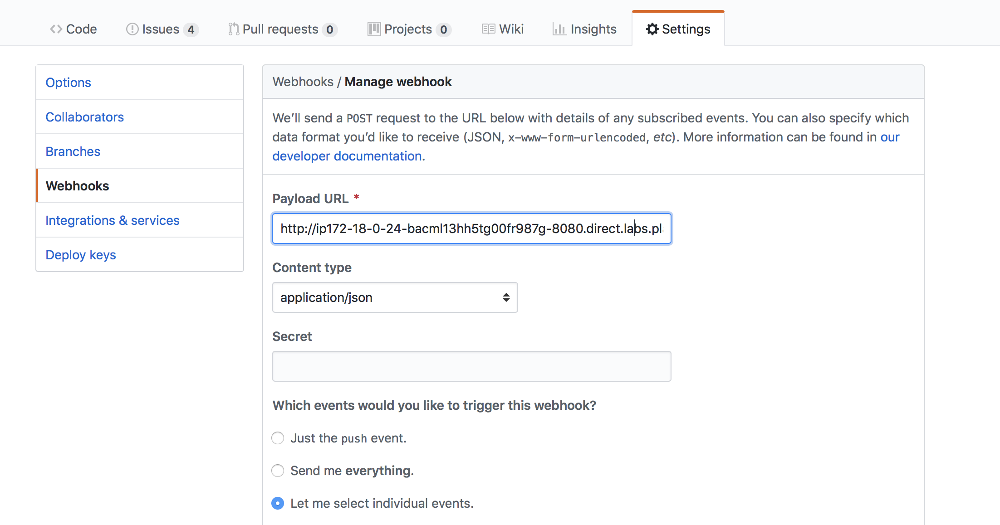

# Lab 5 - Create a GitHub bot

</img>

Before starting this lab, create a new folder for your files:

```
$ mkdir -p lab5 \
   && cd lab5
```

We're going to use OpenFaaS functions to create a GitHub bot named `issue-bot`.

The job of issue-bot is to triage new issues by analysing the sentiment of the "description" field, it will then apply a label of *positive* or *review*. This will help the maintainers with their busy schedule so they can prioritize which issues to look at first.


## Get a GitHub account

* Sign up for a [GitHub account](https://github.com) if you do not already have one.

* Create a new repository and call it *bot-tester*

Note: we will only use this repository as a testing ground for creating Issues. You don't need to commit any code there.

## Set up a tunnel with ngrok

You will need to receive incoming webhooks from GitHub. In production you will have a clear route for incoming traffic but within the constraints of a workshop we have to be creative.

Open a new Terminal and type in:

### _Docker Swarm_

```
$ docker run -p 4040:4040 -d --name=ngrok --net=func_functions \
  alexellis2/ngrok-admin http gateway:8080
```

#### _Kubernetes_

```
$ kubectl -n openfaas run \
--image=alexellis2/ngrok-admin \
--port=4040 \
ngrok -- http gateway:8080

$ kubectl -n openfaas expose deployment ngrok \
--type=NodePort \
--name=ngrok

$ kubectl port-forward deployment/ngrok 4040:4040 -n openfaas
```

Use the built-in UI of `ngrok` at http://127.0.0.1:4040 to find your HTTP URL. You will be given a URL that you can access over the Internet, it will connect directly to your OpenFaaS API Gateway.

> Note: `ngrok` also provides a JSON API at `http://127.0.0.1:4040/api/tunnels`

## Log into the gateway with the ngrok address

Since we now have a new URL for ngrok let's save login details for the new URL:

* Retrieve your password using the [troubleshooting guide](https://docs.openfaas.com/deployment/troubleshooting/#i-forgot-my-gateway-password)

* Run `export PASSWORD="value-here"

* Now log in: `echo $PASSWORD | faas-cli login -g http://fuh83fhfj.ngrok.io --user=admin --password-stdin`

Finally * test the remote URL such as https://fuh83fhfj.ngrok.io

```
$ faas-cli list --gateway https://fuh83fhfj.ngrok.io/
```

> Note: you will notice that because we used the HTTPS url, that the warning about using an insecure certificate disappeared. The OpenFaaS documentation shows [how to setup Ingress with TLS for OpenFaaS](https://docs.openfaas.com/reference/ssl/kubernetes-with-cert-manager/). If you're using a remote cluster then you can try this after completing all the labs.

## Create a webhook receiver `issue-bot`

```
$ faas-cli new --lang python3 issue-bot --prefix="<your-docker-username-here>"
```

Now edit the function's YAML file `issue-bot.yml` and add an environmental variable of `write_debug: true`:

```
provider:
  name: openfaas
  gateway: http://127.0.0.1:8080

functions:
  issue-bot:
    lang: python3
    handler: ./issue-bot
    image: <user-name>/issue-bot
    environment:
      write_debug: true
```

* Build, push and deploy the function with

```
$ faas-cli up -f ./issue-bot.yml
```

## Receive webhooks from GitHub

Log back into GitHub and navigate to your repository *bot-tester*

Click *Settings* -> *Webhooks* -> *Add Webhook*


Now enter the URL you were given from `ngrok` adding `/function/issue-bot` to the end, for example:

```
http://fuh83fhfj.ngrok.io/function/issue-bot
```



For *Content-type* select: *application/json*

Leave *Secret* blank for now.

And select "Let me select individual events"

For events select **Issues** and **Issue comment**


## Check it worked

Now go to GitHub and create a new issue. Type "test" for the title and description.

Check how many times the function has been called - this number should be at least `1`.

```
$ faas-cli list
Function    Invocations
issue-bot   2
```

Each time you create an issue the count will increase due to GitHub's API invoking the function.

You can see the payload sent via GitHub by typing in `docker service logs -f issue-bot` (or `kubectl logs deployment/issue-bot -n openfaas-fn`).

The GitHub Webhooks page will also show every message sent under "Recent Deliveries", you can replay a message here and see the response returned by your function.


### Deploy SentimentAnalysis function

In order to use this issue-bot function, you will need to deploy the SentimentAnalysis function first.
This is a python function that provides a rating on sentiment positive/negative (polarity -1.0-1.0) and subjectivity provided to each of the sentences sent in via the TextBlob project.

If you didnt do so in [Lab 4](./lab4.md) you can deploy "SentimentAnalysis" from the **Function Store**

```
$ echo -n "I am really excited to participate in the OpenFaaS workshop." | faas-cli invoke sentimentanalysis
Polarity: 0.375 Subjectivity: 0.75

$ echo -n "The hotel was clean, but the area was terrible" | faas-cli invoke sentimentanalysis
Polarity: -0.316666666667 Subjectivity: 0.85
```

### Update the `issue-bot` function

Open `issue-bot/handler.py` and replace the template with this code:

```python
import requests, json, os, sys

def handle(req):

    event_header = os.getenv("Http_X_Github_Event")

    if not event_header == "issues":
        sys.exit("Unable to handle X-GitHub-Event: " + event_header)
        return

    gateway_hostname = os.getenv("gateway_hostname", "gateway")

    payload = json.loads(req)

    if not payload["action"] == "opened":
        return

    #sentimentanalysis
    res = requests.post('http://' + gateway_hostname + ':8080/function/sentimentanalysis', data=payload["issue"]["title"]+" "+payload["issue"]["body"])

    if res.status_code != 200:
        sys.exit("Error with sentimentanalysis, expected: %d, got: %d\n" % (200, res.status_code))

    return res.json()
```

Update your `requirements.txt` file with the requests module for HTTP/HTTPs:

```
requests
```

The following line from the code above posts the GitHub Issue's title and body to the `sentimentanalysis` function as text. The response will be in JSON format.

```python
res = requests.post('http://' + gateway_hostname + ':8080/function/sentimentanalysis', data=payload["issue"]["title"]+" "+payload["issue"]["body"])
```

* Build and deploy

Use the CLI to build and deploy the function:

```
$ faas-cli up -f issue-bot.yml
```

Now create a new issue in the `bot-tester` repository. GitHub will respond by sending a JSON payload to your function via the Ngrok tunnel we set up at the start.

You can view the request/response directly on GitHub - navigate to *Settings* -> *Webhook* as below:


## Respond to GitHub

The next step will be for us to apply a label of `positive` or `review`, but because this action involves writing to the repository we need to get a *Personal Access Token* from GitHub.

### Create a Personal Access Token for GitHub

Go to your *GitHub profile* -> *Settings/Developer settings* -> *Personal access tokens* and then click *Generate new token*.


Tick the box for "repo" to allow access to your repositories


Click the "Generate Token" button at the bottom of the page


Create a file called `env.yml` in the directory where your `issue-bot.yml` file is located with the following content:

```yaml
environment:
  auth_token: <auth_token_value>
```

Update the `auth_token` variable with your token from GitHub.

Now update your issue-bot.yml file and tell it to use the `env.yml` file:

```yaml
provider:
  name: openfaas
  gateway: http://127.0.0.1:8080

functions:
  issue-bot:
    lang: python3
    handler: ./issue-bot
    image: <your-username>/issue-bot
    environment:
      write_debug: true
      gateway_hostname: "gateway"
      positive_threshold: 0.25
    environment_file:
    - env.yml
```

> Note: If you're running on Kubernetes, suffix the `gateway_hostname` with `openfaas` namespace:
> ```
> gateway_hostname: "gateway.openfaas"
> ```

> The `positive_threshold` environmental variable is used to fine-tune whether an Issue gets the `positive` or `review` label.

Any sensitive information is placed in an external file (i.e. `env.yml`) so that it can be included in a `.gitignore` file which will help prevent that information getting stored in a public Git repository.

OpenFaaS also supports the use of native Docker and Kubernetes secrets, details can be found in [Lab 10](lab10.md)

### Apply labels via the GitHub API

You can use the API to perform many different tasks, the [documentation is available here](https://github.com/PyGithub/PyGithub).

Here's a sample of Python code that we could use to apply a label, but you do not add it to your function yet.

```python
issue_number = 1
repo_name = "alexellis/issue_bot"
auth_token = "xyz"

g = Github("auth_token")
repo = g.get_repo(repo_name)
issue = repo.get_issue(issue_number)
```

This library for GitHub is provided by the community and is not official, but appears to be popular. It can be pulled in from `pip` through our `requirements.txt` file.

## Complete the function

* Update your `issue-bot/requirements.txt` file and add a line for `PyGithub`

```
requests
PyGithub
```

* Open `issue-bot/handler.py` and replace the code with this:

```python
import requests, json, os, sys
from github import Github

def handle(req):
    event_header = os.getenv("Http_X_Github_Event")

    if not event_header == "issues":
        sys.exit("Unable to handle X-GitHub-Event: " + event_header)
        return

    gateway_hostname = os.getenv("gateway_hostname", "gateway")

    payload = json.loads(req)

    if not payload["action"] == "opened":
        sys.exit("Action not supported: " + payload["action"])
        return

    # Call sentimentanalysis
    res = requests.post('http://' + gateway_hostname + ':8080/function/sentimentanalysis', 
                        data= payload["issue"]["title"]+" "+payload["issue"]["body"])

    if res.status_code != 200:
        sys.exit("Error with sentimentanalysis, expected: %d, got: %d\n" % (200, res.status_code))

    # Read the positive_threshold from configuration
    positive_threshold = float(os.getenv("positive_threshold", "0.2"))

    polarity = res.json()['polarity']

    # Call back to GitHub to apply a label
    apply_label(polarity,
        payload["issue"]["number"],
        payload["repository"]["full_name"],
        positive_threshold)

    return "Repo: %s, issue: %s, polarity: %f" % (payload["repository"]["full_name"], payload["issue"]["number"], polarity)

def apply_label(polarity, issue_number, repo, positive_threshold):
    g = Github(os.getenv("auth_token"))
    repo = g.get_repo(repo)
    issue = repo.get_issue(issue_number)

    has_label_positive = False
    has_label_review = False
    for label in issue.labels:
        if label == "positive":
            has_label_positive = True
        if label == "review":
            has_label_review = True

    if polarity > positive_threshold and not has_label_positive:
        issue.set_labels("positive")
    elif not has_label_review:
        issue.set_labels("review")
```

> The source code is also available at [issue-bot/bot-handler/handler.py](./issue-bot/bot-handler/handler.py)

* Build and deploy

Use the CLI to build and deploy the function:

```
$ faas-cli up -f issue-bot.yml
```

Now try it out by creating some new issues in the `bot-tester` repository. Check whether `positive` and `review` labels were properly applied and consult the GitHub Webhooks page if you are not sure that the messages are getting through or if you suspect an error is being thrown.


> Note: If the labels don't appear immediately, first try refreshing the page

## Validate payload with HMAC

In [Lab 11](lab11.md) we will learn how to protect a serverless function from tampering through the use of HMAC.

Now move on to [Lab 6](lab6.md).
