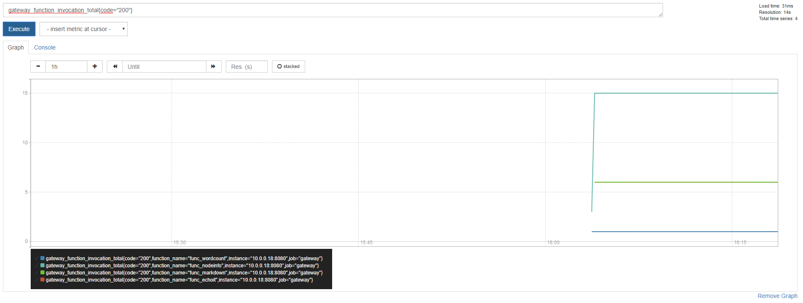
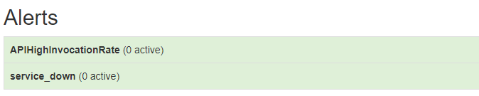

# Lab 8 - Auto-scaling in action

</img>

As described [here](http://docs.openfaas.com/architecture/autoscaling/) in the documentation OpenFaaS ships with auto-scaling in this lab we will have a look how the auto-scaling works in action.

## Pre-requisites:

* Having completed the set-up of OpenFaaS in [Lab 1](https://github.com/openfaas/workshop/blob/master/lab1.md) you will have everything required to trigger auto-scaling.

* Multiple tools can be used to create enough traffic to trigger auto-scaling - we will use `curl` in this example which is easily available for Mac, Linux and is packaged with Git Bash on Windows.

## Background on auto-scaling

Out of the box OpenFaaS is set up in a way that it will auto-scale based upon `request per seconds` measured through Prometheus as traffic pases through the API Gateway. If the defined threshold for the `request per seconds` is exceeded the AlertManager will fire. You should customise this threshold for production usage but we have set it at a low value for demonstration purposes.

> Find more information on auto-scaling in the [documentation site](http://docs.openfaas.com/architecture/autoscaling/).

Each time the alert is fired by AlertManager the API Gateway will add a certain number of replicas of your function into the cluster. OpenFaaS has two configuration options that allow to specify the starting/minimum amount of replicas and also allows to ceil the maximum amount of replicas:

You can control the minimum amount of replicas for function by setting `com.openfaas.scale.min`, the default value is currently `1`. 

You can control the maximum amount of replicas that can spawn for a function by setting `com.openfaas.scale.max`, the default value is currently `20`. 

> Note: If you set `com.openfaas.scale.min` and `com.openfaas.scale.max` to the same value you are disabling the auto-scaling feature. 

## Check out Prometheus

Open Prometheus in a web-browser: `http://localhost:9090/graph`

Now add a graph with all successful invocation of the deployed functions. We can do this by executing `rate( gateway_function_invocation_total{code="200"} [20s])` as a query. Resulting in a page that looks like this:

 

 Go ahead an open a new tab in which you navigate to the alert section using `http://localhost:9090/alerts`. On this page, you can later see when the threshold for the `request per seconds` is exceeded.

 

### Trigger scaling of NodeInfo

First deploy nodeinfo via the store:

```bash
$ faas store deploy nodeinfo
```

Now check the UI to see when the nodeinfo function becomes available.

Use this script to invoke the `nodeinfo` function over and over until you see the replica count go from 1 to 5 and so on. You can monitor this value in Prometheus by adding a graph for `gateway_service_count` or by viewing the API Gateway with the function selected.

 ```bash
$ while [ true ]; do curl -X POST http://localhost:8080/function/nodeinfo; done;
 ```

### Monitor for alerts

You should now be able to see an increase of invocation for the `nodeinfo` function in the graph we created earlier. Move over to the tab where you have open the alerts page. After a time period, you should start seeing that the `APIHighInvocationRate` state (and color) changes to `Pending` before then once again changing to `Firing`. You are also able to see the auto-scaling using the `$ faas-cli list` or over the [Ui](http://localhost:8080)

 

Now you can verify using `$ docker service ps nodeinfo` that new replicas of `nodeinfo` have been started.

Now stop the bash script and you will see the replica count return to 1 replica after a few seconds.

You can return to the [main page](./README.md).
