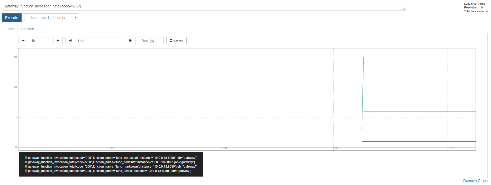
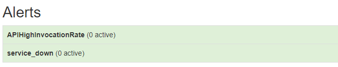
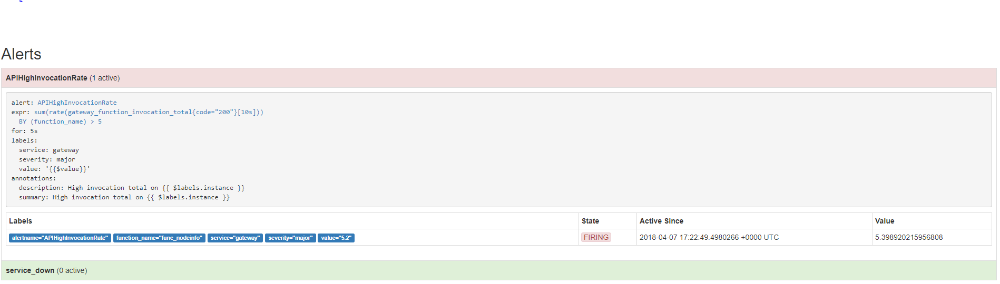

# Lab 9 - Advanced feature - Auto-scaling

</img>

## Auto-scaling in action

As described in the [documentation](http://docs.openfaas.com/architecture/autoscaling/) OpenFaaS ships with auto-scaling. In this lab we will have a look how the auto-scaling works in action.

### Pre-requisites:

* Having completed the set-up of OpenFaaS in [Lab 1](./lab1.md) you will have everything required to trigger auto-scaling.

* Multiple tools can be used to create enough traffic to trigger auto-scaling - in this example `curl` will be used as it is easily available for Mac, Linux and is packaged with Git Bash on Windows.

### Background on auto-scaling

Out of the box OpenFaaS is configured such that it will auto-scale based upon the `request per seconds` metric as measured through Prometheus.  This measure is captured as traffic passes through the API Gateway. If the defined threshold for `request per seconds` is exceeded the AlertManager will fire. This threshold should be reconfigured to an appropriate level for production usage as for demonstration purposes it has been set to a low value in this example.

> Find more information on auto-scaling in the [documentation site](http://docs.openfaas.com/architecture/autoscaling/).

Each time the alert is fired by AlertManager the API Gateway will add a certain number of replicas of your function into the cluster. OpenFaaS has two configuration options that allow to specify the starting/minimum amount of replicas and also allows to ceil the maximum amount of replicas:

You can control the minimum amount of replicas for function by setting `com.openfaas.scale.min`, the default value is currently `1`. 

You can control the maximum amount of replicas that can spawn for a function by setting `com.openfaas.scale.max`, the default value is currently `20`. 

> Note: If you set `com.openfaas.scale.min` and `com.openfaas.scale.max` to the same value you are disabling the auto-scaling feature. 

### Check out Prometheus

You will need to run this port-forwarding command in order to be able to access Prometheus on `http://127.0.0.1:9090`:
```
$ kubectl port-forward deployment/prometheus 9090:9090 -n openfaas
```

Now add a graph with all successful invocation of the deployed functions. We can do this by executing `rate( gateway_function_invocation_total{code="200"} [20s])` as a query. Resulting in a page that looks like this:

 

 Go ahead an open a new tab in which you navigate to the alert section using `http://127.0.0.1:9090/alerts`. On this page, you can later see when the threshold for the `request per seconds` is exceeded.

 

### Trigger scaling of a Go function

First the "echo-fn" function from Alex Ellis:

```bash
$ git clone https://github.com/alexellis/echo-fn \
 && cd echo-fn \
 && faas-cli template store pull golang-http \
 && faas-cli deploy \
  --label com.openfaas.scale.max=10 \
  --label com.openfaas.scale.min=1
```

Now check the UI to see when the `go-echo` function goes from `Not Ready` to `Ready`. You can also check this with `faas-cli describe go-echo`

Use this script to invoke the `go-echo` function over and over until you see the replica count go from 1 to 5 and so on. You can monitor this value in Prometheus by adding a graph for `gateway_service_count` or by viewing the API Gateway with the function selected.

 ```bash
$ for i in {0..10000};
do
    echo -n "Post $i" | faas-cli invoke go-echo && echo;
done;
 ```

> Note: If you're running on Kubernetes, use `$OPENFAAS_URL` instead of `http://127.0.0.1:8080`

### Monitor for alerts

You should now be able to see an increase in invocations of the `go-echo` function in the graph that was created earlier. Move over to the tab where you have open the alerts page. After a time period, you should start seeing that the `APIHighInvocationRate` state (and colour) changes to `Pending` before then once again changing to `Firing`. You are also able to see the auto-scaling using the `$ faas-cli list` or over the [ui](http://127.0.0.1:8080)

 

Now you can verify using `$ docker service ps go-echo` that new replicas of `go-echo` have been started.

Now stop the bash script and you will see the replica count return to 1 replica after a few seconds.

### Troubleshooting

If you believe that your auto-scaling is not triggering, then check the following:

* The Alerts page in Prometheus - this should be red/pink and say "FIRING" - i.e. at http://127.0.0.1:9090/alerts
* Check the logs of the core services i.e. the gateway, Prometheus / AlertManager

To get logs for the core services run `docker service ls` then `docker service logs <service-name>`.

### Load-testing (optional)

It is important to note that there is a difference between applying a scientific method and tooling to a controlled environment and running a Denial Of Service attack on your own laptop. Your laptop is not suitable for load-testing because generally you are running OpenFaaS in a Linux VM on a Windows or Mac host which is also a single node. This is not representative of a production deployment.

See the documentation on [constructing a proper performance test](https://docs.openfaas.com/architecture/performance/).

If `curl` is not generating enough traffic for your test, or you'd like to get some statistics on how things are broken down then you can try the `hey` tool. `hey` can generate a structured load by requests per second or a given duration.

Here's an example of running on a 1GHz 2016 12" MacBook with Docker Desktop. This is a very low-powered computer and as described, not representative of production performance. 

```bash
$ hey -z=30s -q 5 -c 2 -m POST -d=Test http://127.0.0.1:8080/function/go-echo
Summary:
  Total:        30.0203 secs
  Slowest:      0.0967 secs
  Fastest:      0.0057 secs
  Average:      0.0135 secs
  Requests/sec: 9.9932

  Total data:   1200 bytes
  Size/request: 4 bytes

Response time histogram:
  0.006 [1]     |
  0.015 [244]   |■■■■■■■■■■■■■■■■■■■■■■■■■■■■■■■■■■■■■■■■
  0.024 [38]    |■■■■■■
  0.033 [10]    |■■
  0.042 [4]     |■
  0.051 [1]     |
  0.060 [0]     |
  0.069 [0]     |
  0.078 [0]     |
  0.088 [0]     |
  0.097 [2]     |


Latency distribution:
  10% in 0.0089 secs
  25% in 0.0101 secs
  50% in 0.0118 secs
  75% in 0.0139 secs
  90% in 0.0173 secs
  95% in 0.0265 secs
  99% in 0.0428 secs

Details (average, fastest, slowest):
  DNS+dialup:   0.0000 secs, 0.0057 secs, 0.0967 secs
  DNS-lookup:   0.0000 secs, 0.0000 secs, 0.0000 secs
  req write:    0.0001 secs, 0.0000 secs, 0.0016 secs
  resp wait:    0.0131 secs, 0.0056 secs, 0.0936 secs
  resp read:    0.0001 secs, 0.0000 secs, 0.0013 secs

Status code distribution:
  [200] 300 responses
```

The above simulates two active users `-c` at 5 requests per second `-q` over a duration `-z` of 30 seconds.

To use `hey` you must have Golang installed on your local computer.

See also: [hey on GitHub](https://github.com/rakyll/hey)

### Try scale from zero

If you scale down your function to 0 replicas, you can still invoke it. The invocation will trigger the gateway into scaling the function to a non-zero value.

Try it out with the following command:

```
$ kubectl scale deployment --replicas=0 nodeinfo -n openfaas-fn
```

Open the OpenFaaS UI and check that nodeinfo has 0 replicas, or by `kubectl get deployment nodeinfo -n openfaas-fn`.

Now invoke the function and check back that it scaled to 1 replicas.

Now move onto [Lab 10](lab10.md).
