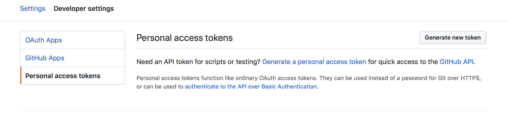

# Lab 5 - 创建一个 GitHub 机器人

</img>

在开始这个实验之前，为你的文件创建一个新的文件夹。

```sh
$ mkdir -p lab5\
   && cd lab5
```

我们将使用 OpenFaaS 的函数来创建一个名为 `issue-bot`的 GitHub 机器人。

问题机器人的工作是通过分析 `描述` 字段的情绪来分流新的问题，然后它将应用一个*积极*或*审查*的标签。这将有助于维护者在繁忙的工作中，可以优先考虑哪些问题需要首先处理。

问题机器人的图示](./diagram/issue-bot.png)

## 获取一个 GitHub 账户

* 注册一个[GitHub 账户](https://github.com)，如果你还没有一个账户。

* 创建一个新的仓库，并将其称为*bot-test*。

注意：我们将只使用这个仓库作为创建问题的测试场所。你不需要在那里提交任何代码。

## 建立一个带有入口的隧道

你需要接收来自 GitHub 的 webhooks。幸运的是，inlets 让这一切变得非常快速和简单。它可以按月或按年订阅，所以如果你不确定是否全年都需要它，你可以只付一个月的钱。

inlets 有一个叫做 inlets-operator 的 Kubernetes 集成。你可以用它来设置 LoadBalancers 或带有 TLS 的 Ingress。它的工作原理是为你创建一个云虚拟机，并在那里运行一个隧道服务器，然后为你运行一个隧道客户端作为一个 Pod，你就可以获得传入流量。

在你喜欢的云提供商（如 DigitalOcean）的 API 页面下创建一个写入访问令牌，然后将内容保存到`digital-ocean-api-token.txt`。

设置完订阅后，将你的密钥保存到`$HOME/.inlets/LICENSE`，然后运行以下程序。

```bash
arkade install inlets-operator \
  --provider digitalocean \
  --region lon1 \
  --token-file $HOME/digital-ocean-api-token.txt
```

这将部署 inlets-operator，并指示它在 DigitalOcean 上为你的隧道服务器配置新的主机到伦敦地区。其他供应商和地区也可以使用，[更多信息请见文档](https://docs.inlets.dev/reference/inlets-operator/)。

## 用网关的公共 IP 登录你的网关

用信息检索你的网关密码，从。

```bash
arkade info openfaas
```

LoadBalancer 的公共 IP 大约需要 10-30 秒才能出现。

```bash
kubectl get svc -n openfaas gateway-external
NAME               TYPE           CLUSTER-IP    EXTERNAL-IP   PORT(S)          AGE
gateway-external   LoadBalancer   10.96.29.46   <pending>     8080:32278/TCP   5h56m
gateway-external   LoadBalancer   10.96.29.46   165.227.233.227   8080:32278/TCP   5h56m
```

然后把它保存到环境变量中。

```bash
export OPENFAAS_URL=http://165.227.233.227:8080
```

用给你的密码登录到公共 IP。

```bash
echo $PASSWORD | faas-cli login --password-stdin
```

最后测试远程 URL，如http://165.227.233.227:8080

你可以通过设置`OPENFAAS_URL`环境变量或使用`--gateway`标志来对远程网关运行命令。

如果你想用 TLS 证书和自定义域名来暴露 OpenFaaS，你可以按照这些说明来代替。

```bash
arkade install ingress-nginx
arkade install cert-manager
arkade install openfaas
arkade install openfaas-ingress \
  --email web@example.com \
  --domain openfaas.example.com
```

然后创建一个 DNS A 记录，指向 ingress-nginx 的 IP 地址。

```bash
kubectl get svc ingress-nginx-controller
NAME                       TYPE           CLUSTER-IP     EXTERNAL-IP   PORT(S)                      AGE
NAME                       TYPE           CLUSTER-IP     EXTERNAL-IP   PORT(S)                      AGE
ingress-nginx-controller   LoadBalancer   10.96.179.20   <pending>     80:30319/TCP,443:31591/TCP   20s
ingress-nginx-controller   LoadBalancer   10.96.179.20   209.97.135.63   80:30319/TCP,443:31591/TCP   52s
```

现在你可以为`https://openfaas.example.com`提供一个自定义的 TLS 记录。 

## 创建一个 webhook 接收器`issue-bot`

```bash
export OPENFAAS_PREFIX="docker.io/your-username"
$ faas-cli new --lang python3 \
  issue-bot
```

现在编辑该函数的 YAML 文件`issue-bot.yml`并添加一个环境变量`write_debug: true`。

```yaml
provider:
  name: openfaas
  gateway: http://127.0.0.1:8080

functions:
  issue-bot:
    lang: python3
    handler: ./issue-bot
    image: docker.io/your-username/issue-bot
    environment:
      write_debug: true
```

* 构建、推送和部署该函数，使用

```bash
$ faas-cli up -f ./issue-bot.yml
```

## 从 GitHub 接收 webhooks

重新登录 GitHub 并导航到你的仓库*bot-tester*。

点击 *设置* -> *Webhooks* -> *添加 Webhook*


现在输入你从 inlets 或你的自定义域中得到的 URL，在最后加上`/function/issue-bot`，例如。

```plain
https://openfaas.example.com
```


对于*Content-type*选择。*application/json*

暂时将*Secret*留空。

并选择 `让我选择个别事件`

对于事件选择**事件**和**事件评论**。

！[设置事件](../../screenshot/WebhookEventsSettings.png)

## 检查它是否有效

现在去 GitHub，创建一个新问题。在标题和描述中输入 `test`。

检查该函数被调用了多少次--这个数字至少应该是`1`。

```sh
$ faas-cli list
Function    Invocations
issue-bot   2
```

每次你创建一个问题，由于 GitHub 的 API 调用了该函数，计数会增加。

你可以通过输入`docker service logs -f issue-bot`（或`kubectl logs deployment/issue-bot -n openfaas-fn`）看到通过 GitHub 发送的有效载荷。

GitHub 的 Webhooks 页面也会在 `Recent Deliveries`下显示每条发送的消息，你可以在这里重放一条消息，看看你的函数返回的响应。


### 部署 SentimentAnalysis 函数

为了使用这个 issue-bot 函数，你将需要首先部署 SentimentAnalysis 函数。
这是一个 python 函数，为通过 TextBlob 项目输入的每个句子提供正/负（极性-1.0-1.0）和主观性的评级。

如果你在[Lab 4](./lab4.md)中没有这样做，你可以从**函数商店**部署 `SentimentAnalysis`。

```sh
$ echo -n "I am really excited to participate in the OpenFaaS workshop." | faas-cli invoke sentimentanalysis
Polarity: 0.375 Subjectivity: 0.75

$ echo -n "The hotel was clean, but the area was terrible" | faas-cli invoke sentimentanalysis
Polarity: -0.316666666667 Subjectivity: 0.85
``` 

### 更新`issue-bot`函数

打开`issue-bot/handler.py`，用这段代码替换模板。

```python
import requests, json, os, sys

def handle(req):

    event_header = os.getenv("Http_X_Github_Event")

    if not event_header == "issues":
        sys.exit("Unable to handle X-GitHub-Event: " + event_header)
        return

    gateway_hostname = os.getenv("gateway_hostname", "gateway.openfaas")

    payload = json.loads(req)

    if not payload["action"] == "opened":
        return

    #sentimentanalysis
    res = requests.post('http://' + gateway_hostname + ':8080/function/sentimentanalysis', data=payload["issue"]["title"]+" "+payload["issue"]["body"])

    if res.status_code != 200:
        sys.exit("Error with sentimentanalysis, expected: %d, got: %d\n" % (200, res.status_code))

    return res.json()
```

用 HTTP/HTTPs 的请求模块更新你的`requirements.txt`文件。

```plain
requests
```

在`issue-bot.yml`文件中添加`gateway_hostname`环境变量，并将其值设置为`gateway.openfaas`。
```plain
    ...
    environment:
      gateway_hostname: "gateway.openfaas"
    ...
```

上面代码中的下面一行将 GitHub 问题的标题和正文作为文本发布给`sentimentanalysis`函数。响应将是 JSON 格式。

```python
res = requests.post('http://' + gateway_hostname + ':8080/function/sentimentanalysis', data=payload["issue"]["title"]+" "+payload["issue"]["body"])
```

* 构建和部署

使用 CLI 来构建和部署该函数。

```plain
$ faas-cli up -f issue-bot.yml
```

现在在`bot-test`仓库中创建一个新问题。GitHub 将通过我们之前配置的 Inlets 隧道向你的函数发送一个 JSON 有效载荷。

你可以在 GitHub 上直接查看请求/响应--导航到*Settings* -> *Webhook*，如下所示。


## 回复到 GitHub

下一步是让我们贴上 `正面` 或 `评论` 的标签，但由于这个动作涉及到向仓库写入内容，我们需要从 GitHub 获得一个*个人访问令牌*。

### 为 GitHub 创建一个个人访问令牌

进入你的*GitHub 配置文件* -> *设置/开发者设置* -> *个人访问令牌*，然后点击*生成新令牌*。



勾选 `repo`的方框，允许访问你的存储库


点击页面底部的 `Generate Token`按钮

在你的`issue-bot.yml`文件所在的目录中创建一个名为`env.yml`的文件，内容如下。

```yaml
environment:
  auth_token: <auth_token_value>
```

用 GitHub 上的令牌更新`auth_token`变量。

现在更新你的 issue-bot.yml 文件，告诉它使用`env.yml`文件。 

```yaml
provider:
  name: openfaas
  gateway: http://127.0.0.1:8080

functions:
  issue-bot:
    lang: python3
    handler: ./issue-bot
    image: <your-username>/issue-bot
    environment:
      write_debug: true
      gateway_hostname: "gateway.openfaas"
      positive_threshold: 0.25
    environment_file:
    - env.yml
```
> `positive_threshold`环境变量用于微调一个问题是否获得`positive`或`review`标签。

任何敏感信息都会被放在一个外部文件中（即`env.yml`），这样它就可以被包含在`.gitignore`文件中，这将有助于防止这些信息被存储在公共的 Git 仓库中。

OpenFaaS 也支持使用原生的 Docker 和 Kubernetes 的secret，详情请见[Lab 10](lab10.md)

### 通过 GitHub 的 API 应用标签

你可以使用 API 来执行许多不同的任务，[文档在这里可以找到](https://github.com/PyGithub/PyGithub)。

下面是一个 Python 代码的例子，我们可以用它来应用标签，但你先不要把它添加到你的函数中。

```python
issue_number = 1
repo_name = "alexellis/issue_bot"
auth_token = "xyz"

g = Github(auth_token)
repo = g.get_repo(repo_name)
issue = repo.get_issue(issue_number)
```

这个用于 GitHub 的库是由社区提供的，不是官方的，但似乎很受欢迎。它可以通过我们的`requirements.txt`文件从`pip`调入。

## 完成函数

* 更新你的`issue-bot/requirements.txt`文件，为`PyGithub`添加一行内容

```plain
requests
PyGithub
```

* 打开`issue-bot/handler.py`，将代码替换为以下内容。

```python
import requests, json, os, sys
from github import Github

def handle(req):
    event_header = os.getenv("Http_X_Github_Event")

    if not event_header == "issues":
        sys.exit("Unable to handle X-GitHub-Event: " + event_header)
        return

    gateway_hostname = os.getenv("gateway_hostname", "gateway.openfaas")

    payload = json.loads(req)

    if not payload["action"] == "opened":
        sys.exit("Action not supported: " + payload["action"])
        return

    # Call sentimentanalysis
    res = requests.post('http://' + gateway_hostname + ':8080/function/sentimentanalysis', 
                        data= payload["issue"]["title"]+" "+payload["issue"]["body"])

    if res.status_code != 200:
        sys.exit("Error with sentimentanalysis, expected: %d, got: %d\n" % (200, res.status_code))

    # Read the positive_threshold from configuration
    positive_threshold = float(os.getenv("positive_threshold", "0.2"))

    polarity = res.json()['polarity']

    # Call back to GitHub to apply a label
    apply_label(polarity,
        payload["issue"]["number"],
        payload["repository"]["full_name"],
        positive_threshold)

    return "Repo: %s, issue: %s, polarity: %f" % (payload["repository"]["full_name"], payload["issue"]["number"], polarity)

def apply_label(polarity, issue_number, repo, positive_threshold):
    g = Github(os.getenv("auth_token"))
    repo = g.get_repo(repo)
    issue = repo.get_issue(issue_number)

    has_label_positive = False
    has_label_review = False
    for label in issue.labels:
        if label == "positive":
            has_label_positive = True
        if label == "review":
            has_label_review = True

    if polarity > positive_threshold and not has_label_positive:
        issue.set_labels("positive")
    elif not has_label_review:
        issue.set_labels("review")
```

> 源代码也可在[issue-bot/bot-handler/handler.py](./issue-bot/bot-handler/handler.py)

* 构建和部署

使用 CLI 来构建和部署该函数。

```plain
$ faas-cli up -f issue-bot.yml
```

现在通过在`bot-test`仓库中创建一些新的问题来试试。检查 `正面`和 `评论`标签是否被正确应用，如果你不确定信息是否被传递或怀疑有错误被抛出，请查阅 GitHub Webhooks 页面。


> 注意：如果标签没有立即出现，请先尝试刷新页面。

## 用 HMAC 验证有效载荷

在[Lab 11](lab11.md)中，我们将学习如何通过使用 HMAC 保护无服务器函数不被篡改。

现在转到[Lab 6](lab6.md)。
