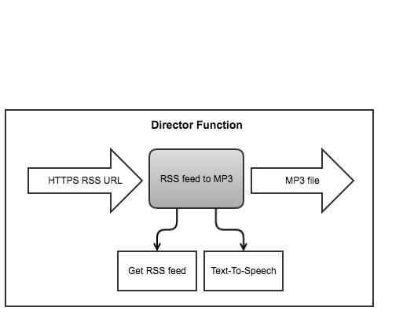

# Appendix

## Prometheusでメトリクスを確認する（PromQL）

functionが何回呼ばれたかというのを見たいときには2つの方法があることがワークショップでわかったと思います：

* OpenFaaSのUIからfunctionを選択して確認
* `faas-cli list` で確認

3つ目の方法としてPrometheusのUIから確認する方法があります。OpenFaaSはPrometheusにメトリクスを公開しています。

http://127.0.0.1:9090 にアクセスしましょう（ローカルではなくリモートのサーバーを使っている場合は適宜変更してください）

「Expression」に以下を入力してください：

```
rate ( gateway_function_invocation_total [20s] ) 
```

それでは *Execute* をクリックして、タブは *Graph* を選択しましょう。このグラフにはどのfunctionがいつ、どのくらい呼ばれたか可視化しています。

Prometheusは継続的にこれらの情報を記録しています。HTTPのレスポンスコードで絞り込むこともできるので、失敗したfunctionの呼び出しなどを見つけることができます。

以下を実行してみてください:

```
$ echo test | faas-cli invoke non-existing-function
```

少し間を置いてからPrometheusのUIを再度みてみましょう。404のエラーが `non-existing-function` に対して記録されているのが確認できます。

HTTPレスポンスが200のものだけを見たい場合は次のコマンドをExpressionを入力します：

```
rate ( gateway_function_invocation_total{code="200"} [20s] ) 
```

`figlet` function の結果だけを見たい場合は以下のようになります：

```
rate ( gateway_function_invocation_total{function_name="figlet"} [20s] ) 
```

## Directorパターン (functionの連鎖)

*Directorパターン* は [こちらのドキュメント](https://github.com/openfaas/faas/blob/7b300ce1f962d3caefe75b3570ca260418175a43/guide/chaining_functions.md) で述べられていますが、 director としてのfunctionを一つ用意して、その function は他の functionを呼ぶためだけに作られています。これは [Lab6](./lab6.md) で紹介した function の連鎖方法の2つの方法を組み合わせたハイブリッドなアプローチになります。



上の図では *director function* として「RSS Feed to MP3」というfunctionがあり、サーバーサイドの別のfunctionを2つ呼んで、結果を返すというワークフローを実現しています。director functionを使うメリットとしては、このfunctionもまたバージョン管理できますし、ビルド、デプロイも他のfunction同様に行うことができる点です。

RSSのURLはdirectorを介して「Get RSS feed」functionに渡り、その結果（パースされたRSSフィード）はまたdirectorを介して「Text-ToSpeech」functionに渡り、結果としてMP3ファイルがdirectorから返ってくる流れとなります。