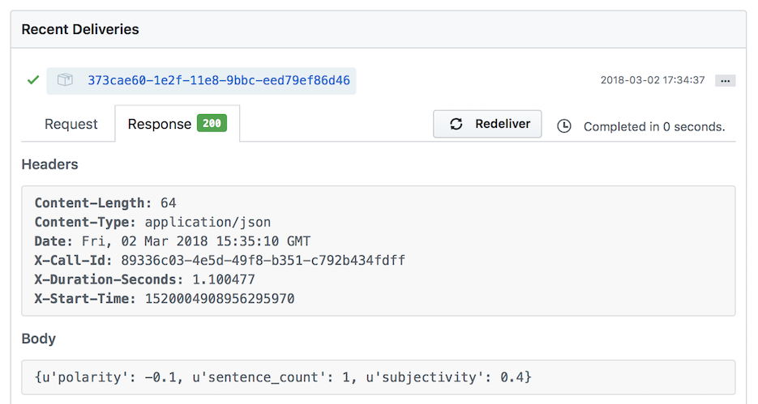
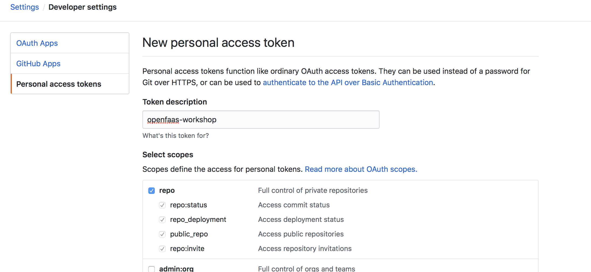

# Lab 5 - Gitbotを作ろう

</img>

このラボを始める前に作業用のディレクトリを作成しましょう：

```
$ mkdir -p lab5 \
   && cd lab5
```

このワークショップでは今まで学んだことを応用して `issue-bot` というGitHubのBotをOpenFaaSのfunctionで作ります。

issue-botを使ってGitHub Issueの感情を分析し、 *positive* または *review* というラベルを付与します。こうすることで普段忙しいであろうリポジトリのメンテナーたちにとってどのIssueを優先して見たほうがいいかという手助けになります。


## GitHubのアカウントを取得

* [GitHubのアカウント](https://github.com)を持っていない場合はアカウント登録をしてください。
* 新しいリポジトリを *bot-tester* という名前で作ります。

> 注：このリポジトリはこのワークショップのIssueのテストに使うだけなので、ここにコードをコミットする必要はありません。

## ngrokでトンネルを作る

GitHubからwebhookを受け取る必要があります。本番環境であればインターネットからリクエストを受け取る環境が整っているかと思いますが、ワークショップや開発環境レベルではなかなかそうもいかないので工夫が必要です。

ターミナルを開いて次のコマンドを入力しましょう：

```
$ docker run -p 4040:4040 -d --name=ngrok --net=func_functions \
  alexellis2/ngrok-admin http gateway:8080
```

`ngrok` の標準で備わっているUIに http://127.0.0.1:4040 でアクセスして、生成されたHTTPのURLを確認しましょう。このURLを使ってインターネットから直接OpenFaaSのAPI Gatewayにアクセスできます。

> 注: `ngrok` は JSON API も `http://127.0.0.1:4040/api/tunnels` で公開しています

URLを試してみましょう（http://fuh83fhfj.ngrok.io だった場合の例です）

```
$ faas-cli list --gateway http://fuh83fhfj.ngrok.io/
```

## webhookを受け取れる `issue-bot` を作る

```
$ faas-cli new --lang python3 issue-bot --prefix="<DockerHubのユーザー名>"
```

functionのYAMLファイル `issue-bot.yml` を開いて `write_debug: true` という環境変数を増やしましょう：

```
provider:
  name: openfaas
  gateway: http://127.0.0.1:8080

functions:
  issue-bot:
    lang: python3
    handler: ./issue-bot
    image: <DockerHubのユーザー名>/issue-bot
    environment:
      write_debug: true
```

* functionをbuild、push、deployしましょう

```
$ faas-cli up -f ./issue-bot.yml
```

## GitHubからwebhookを受け取る

GitHubに戻って先程作った *bot-tester* を開きます

*Settings* -> *Webhooks* -> *Add Webhook* をクリックします


ここで先程の `ngrok` のURLを入力し、末尾に `/function/issue-bot` を追記します。次のようになります：

```
http://fuh83fhfj.ngrok.io/function/issue-bot
```


*Content-type* には *application/json* を選択

*Secret* は今のところ空白

"Let me select individual events" を選択

イベントは **Issues** と **Issue comment** を選択


## webhookの動作確認

それではGitHubのリポジトリで新しいIssueを作りましょう。titleもdescriptionも「test」と入力します。

functionが何回呼ばれたか確認しましょう - 少なくとも `1回` は呼ばれているはずです。

```
$ faas-cli list
Function    Invocations
issue-bot   2
```

Issueを作る度にGitHubのAPIがfunctionを呼ぶので回数が増えていきます。

GitHubからのリクエストのペイロードは `docker service logs -f issue-bot` で確認することができます。

GitHubのWebhooksページでも「Recent Deliveries」の下で今までのメッセージの履歴を確認できます。ここでwebhookを再実行して function からのレスポンスを確認することもできます。


### Sentiment Analysis functionのデプロイ

issue-bot functionを使うにはまず SentimentAnalysis functionをデプロイする必要があります。このfunctionはPythonで書かれていて、与えられた（英語の）文章に対してポジティブかどうか（極性 -1.0 - 1.0）と、主観的かどうかという感情の指標を返します。

「SentimentAnalysis」は **Function Store** からデプロイできます。

```
$ echo -n "I am really excited to participate in the OpenFaaS workshop." | faas-cli invoke sentimentanalysis
Polarity: 0.375 Subjectivity: 0.75

$ echo -n "The hotel was clean, but the area was terrible" | faas-cli invoke sentimentanalysis
Polarity: -0.316666666667 Subjectivity: 0.85
```

### `issue-bot` function を編集しましょう

`issue-bot/handler.py` を開いて次のコードに置き換えます：

```python
import requests, json, os, sys

def handle(req):

    event_header = os.getenv("Http_X_Github_Event")

    if not event_header == "issues":
        sys.exit("Unable to handle X-GitHub-Event: " + event_header)
        return

    gateway_hostname = os.getenv("gateway_hostname", "gateway.openfaas")

    payload = json.loads(req)

    if not payload["action"] == "opened":
        return

    #sentimentanalysis
    res = requests.post('http://' + gateway_hostname + ':8080/function/sentimentanalysis', data=payload["issue"]["title"]+" "+payload["issue"]["body"])

    if res.status_code != 200:
        sys.exit("Error with sentimentanalysis, expected: %d, got: %d\n" % (200, res.status_code))

    return res.json()
```

`requirements.txt` にHTTP/HTTPSリクエストで必要になる requests モジュールを追加します：

```
requests
```

下のコードの部分でGitHubのIssueのtitleとbodyを `sentimentanalysis` function にテキストでPostしています。レスポンスはJSONで返ってきます。

```python
res = requests.post('http://' + gateway_hostname + ':8080/function/sentimentanalysis', data=payload["issue"]["title"]+" "+payload["issue"]["body"])
```

* buildとdeploy

CLIを使ってfunctionのbuildとdeployをしましょう：

```
$ faas-cli up -f issue-bot.yml
```

それでは `bot-tester` リポジトリに新しいIssueを作ってみましょう。GitHubはJSONのペイロードを上で作ったNgrokのトンネルを経由して function に渡します。

このリクエストとレスポンスはGitHubの *Settings* -> *Webhook* のページで確認できます：



## GitHubに応答する

次に `positive` か `review` のラベルを付与したいのですが、これにはリポジトリへの書き込み権限が必要になります。そのため、 *Personal Access Token* をGitHubで取得する必要があります。

### Personal Access TokenをGitHubで作る

*GitHub profile* -> *Settings/Developer settings* -> *Personal access tokens* で *Generate new token* をクリックします。


「repo」にチェックを入れてリポジトリへのアクセス権を付与します。



ページ下部の「Generate Token」ボタンをクリックします。

`env.yml` というファイルを `issue-bot.yml` と同じ場所に作ります。中に以下の内容を貼り付けましょう：

```yaml
environment:
  auth_token: <auth_token_value>
```

`auth_token` の値にはGitHubが発行したトークンを入力します。

それでは `issue-bot.yml` ファイルを開いて `env.yml` を使うように編集しましょう：

```yaml
provider:
  name: openfaas
  gateway: http://127.0.0.1:8080

functions:
  issue-bot:
    lang: python3
    handler: ./issue-bot
    image: <DockerHubのユーザー名>/issue-bot
    environment:
      write_debug: true
      gateway_hostname: "gateway"
      positive_threshold: 0.25
    environment_file:
    - env.yml
```

> ここで `positive_threshold` という環境変数にはいい具合に `positive` と `review` のラベルを振り分けれるようにあらかじめ調整した最適と思われる値を入れています。

機密性の高い情報は外部ファイル（例： `env.yml` ）で保持しておくべきです。このファイルを `.gitignore` に記載しておくことで、パブリックなGitリポジトリに誤って機密情報をアップロードしてしまわないようにできます。

OpenFaaSではDockerやKubernetesのSecretを使う機能が備わっています。詳細については [Lab10](./lab10.md) を参照してください。

### GitHub APIを使ってラベルを適用する方法

PyGithubというPythonのライブラリがあり、GitHubのAPIを使って様々なことを簡単にできます。使い方のドキュメントは [こちら](https://github.com/PyGithub/PyGithub) にあります。

以下のようなコードでリポジトリやIssueの情報を取得できます（まだこのコードは function に追加しないでください）。

```python
issue_number = 1
repo_name = "alexellis/issue_bot"
auth_token = "xyz"

g = Github("auth_token")
repo = g.get_repo(repo_name)
issue = repo.get_issue(issue_number)
```

このライブラリはGitHub公式ではないのですが、広く使われているようです。 `requirements.txt` に記載して `pip` で取得できるようにしましょう。

## functionの仕上げ

* `issue-bot/requirements.txt` ファイルを開いて `PyGithub` を追加しましょう

```
requests
PyGithub
```

* `issue-bot/handler.py` を開いて次のようにコードを更新します：

```python
import requests, json, os, sys
from github import Github

def handle(req):
    event_header = os.getenv("Http_X_Github_Event")

    if not event_header == "issues":
        sys.exit("Unable to handle X-GitHub-Event: " + event_header)
        return

    gateway_hostname = os.getenv("gateway_hostname", "gateway.openfaas")

    payload = json.loads(req)

    if not payload["action"] == "opened":
        sys.exit("Action not supported: " + payload["action"])
        return

    # sentimentanalysis functionの呼び出し
    res = requests.post('http://' + gateway_hostname + ':8080/function/sentimentanalysis', 
                        data= payload["issue"]["title"]+" "+payload["issue"]["body"])

    if res.status_code != 200:
        sys.exit("Error with sentimentanalysis, expected: %d, got: %d\n" % (200, res.status_code))

    # 環境変数から positive_threshold を読み込む
    positive_threshold = float(os.getenv("positive_threshold", "0.2"))

    polarity = res.json()['polarity']

    # ラベルを適用するためにGitHubのAPIを使う
    apply_label(polarity,
        payload["issue"]["number"],
        payload["repository"]["full_name"],
        positive_threshold)

    print("Repo: %s, issue: %s, polarity: %f" % (payload["repository"]["full_name"], payload["issue"]["number"], polarity))

def apply_label(polarity, issue_number, repo, positive_threshold):
    g = Github(os.getenv("auth_token"))
    repo = g.get_repo(repo)
    issue = repo.get_issue(issue_number)

    has_label_positive = False
    has_label_review = False
    for label in issue.labels:
        if label == "positive":
            has_label_positive = True
        if label == "review":
            has_label_review = True

    if polarity > positive_threshold and not has_label_positive:
        issue.set_labels("positive")
    elif not has_label_review:
        issue.set_labels("review")
```

> このソースコードは[issue-bot/bot-handler/handler.py](../../issue-bot/bot-handler/handler.py) にも公開しています

* build して deploy

CLIを使ってfunctionをbuildしてdeployします：

```
$ faas-cli up -f issue-bot.yml
```

それでは `bot-tester` のリポジトリにIssueを作ってテストしてみましょう。 `positive` または `review` のラベルが付与されるかどうか確認しましょう。正常に動作しない場合はGitHubのWebhooksのページでメッセージを確認し、エラーが発生していないかみてみましょう。


> 注：ラベルがリアルタイムで付与されない場合はブラウザを再読込してみてください

それでは [Lab 6](lab6.md) に進みましょう。