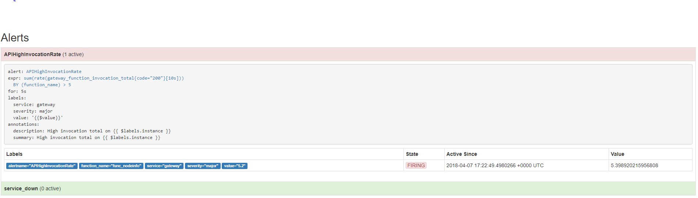

# Lab 9 - 応用編 - functionのオートスケール

</img>

[公式ドキュメント](http://docs.openfaas.com/architecture/autoscaling/)  でも謳われているように、OpenFaaSにはオートスケール機能があります。このLabでは実際にオートスケールが動作するのを見てみましょう。

## 前準備

* [Lab 1](./lab1.md) でOpenFaaSが準備できていれば準備OKです。
* オートスケールを発動させるには様々なツールを使うことができます。ここでは `curl` を使います。Mac、Linuxでほとんどの場合使えますし、WindowsのGit Bashでも内包しています。

## オートスケールの背景

OpenFaaSは標準で `リクエスト/秒` の値によってオートスケールするかどうかを判断しています。これはGatewayのトラフィックをPrometheusが監視することで実現しています。 `リクエスト/秒` の上限を超えた場合にAlertManagerが発火します。本番では最適な値を検証するべきですが、今回はオートスケールを簡単に体験するためにもこの上限は低く設定します。

> オートスケールの詳細については [公式ドキュメント](http://docs.openfaas.com/architecture/autoscaling/) を参照してください。

アラートがAlertManagerから発火するたびにGatewayは、あらかじめ設定している数のレプリカをfunctionに対して増やします。OpenFaaSではレプリカの最小数と最大数をそれぞれラベルを使って設定することができます：

レプリカの最小数は `com.openfaas.scale.min` で設定可能です。デフォルトは `1` です。

レプリカの最大数は `com.openfaas.scale.max` で設定可能です。デフォルトは `20` です。

> 注：`com.openfaas.scale.min` と `com.openfaas.scale.max` を同じ値に設定した場合、オートスケール機能は無効化されます。

## Prometheusの確認

PrometheusのUIをブラウザで開きます： `http://localhost:9090/graph`

functionの成功した呼び出しのグラフを見てみましょう。 `rate(gateway_function_invocation_total{code="200"} [20s])` というクエリを実行することで確認できます。以下のようなページが確認できます：

 

それではアラートを見れる画面を開きましょう： `http://localhost:9090/alerts`. この画面で、 `リクエスト/秒` がいつ上限を超えたかを見ることができます。

 

### NodeInfo functionでオートスケールを確認

まずはstoreからnodeinfo functionをデプロイしましょう：

```bash
$ faas-cli store deploy nodeinfo
```

UIを確認してnodeinfoが有効になるのを確認しましょう。

それでは、以下のスクリプトを実行して `nodeinfo` のレプリカ数が変わるまで延々と呼び続けましょう。レプリカ数はPrometheusで `gateway_service_count` というグラフを追加するか、GatewayのUIのfunctionの画面にて確認することができます。

 ```bash
$ while [ true ]; do curl -X POST http://localhost:8080/function/nodeinfo; done;
 ```

### alertの監視

しばらくすると `nodeinfo` functionの呼び出し回数が上昇しているのが上で作ったPrometheusのグラフで確認できます。アラート画面を見ていると、 `APIHighInvocationRate` の状態（色）も `Pending` から `Firing` に変わるのも確認できます。他にも `$ faas-cli list` コマンドやUIからもオートスケールの様子を確認することができます。 

`$ docker service ps nodeinfo` の実行結果を見ることでも `nodeinfo` のレプリカが上昇しているのが確認できます。

それではスクリプトを停止してみましょう。数秒もすればレプリカが再び1に戻るのが確認できます。

それでは [Lab 10](lab10.md) に進みましょう。